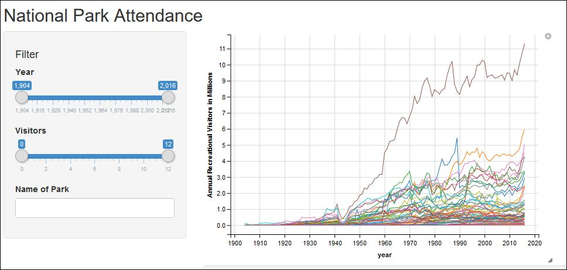
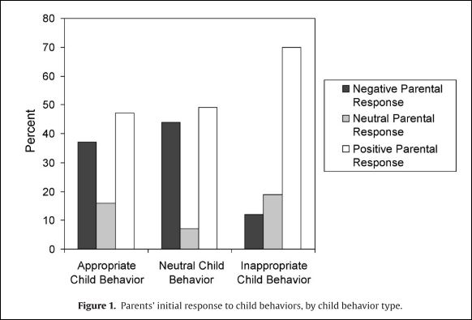

```{r setup, include=FALSE}
options(htmltools.dir.version = FALSE)
```


background-image: url(https://media.giphy.com/media/3oxRmGNqKwCzJ0AwPC/giphy.gif)


---
class: inverse, left, middle

# Visualization One


[National Park Attendance by Year and Park](https://samveverka.shinyapps.io/NationalParksAttendance/)


- Desgined for anyone

- Particularly for those interested in R visualization with shiny apps

- Purpose is to describe changes in national park attendance over the past century

---

#Uses the following packages:

```{r package}
# library(shiny)
# library(reshape2)
# library(ggvis)
# library(dplyr)
# library(DescTools)
```


---

##Strengths 



- Interactive: can change the dates, attendance rate, and park


- Synthesizes a large amount of data


- Simple 

---


##Improvements


- Create a drop-down menu for national park names 


- Use scale_y_log() to improve visibility of data from parks with lower attendance


- Make it color blind friendly: make all park lines in gray, color or highlight selected park lines


- An option to highlight one park in relation to all others; as it is, only the selected park line shows up

- An option to select multiple parks for comparison (example: National Parks in the Northwest)

[Link](https://samveverka.shinyapps.io/NationalParksAttendance/)


---
class: left, middle, inverse
#Visualization Two: Parent-Child Relationships


- Academic Audience

- Communicates that parents are *most* likely to respond to negative child behavior with positive skills; whereas parents are *equally* likely to respond to appropriate child behavior with positive or negative skills. 

--

---


class: center, middle
```{r 2, echo = FALSE, }

```

<font size="2">Source: Hakman, M., Chaffin, M., Funderburk, B., & Silovsky, J. F. (2009). Change trajectories for parent-child interaction sequences during parent-child interaction therapy for child physical abuse. Child Abuse & Neglect, 33(7), 461-470.</font>


---


```{r 4, echo = FALSE, }

```

##Strength

- The side by side comparison; visualization would be less effective with only one comparison


---

```{r 3, echo = FALSE, fig.retina=2 }

```
##Improvements

- Take out neutral child behavior, maybe even neutral parent behavior

- Add color to the bars for positive and negative parent responses

- Relabel y-axis - percent is confusing - perhaps total number?

- Reorder so that positive parent responses (i.e., highest bar) is first

- Relabel the figure


---

class: center, middle, inverse

# Thanks!

Slides created via the R package [**xaringan**](https://github.com/yihui/xaringan).


